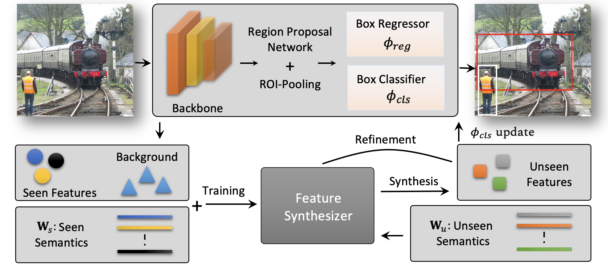
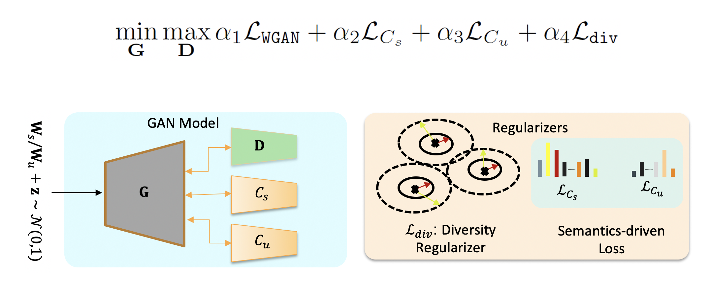

## Synthesizing the Unseen for Zero-shot Object Detection

Zero Shot Detection (ZSD) is a recently introduced paradigm which enables simultaneous localization and classification of previously unseen objects. It is arguably the most extreme case of learning with minimal supervision. we propose a symantically driven conditional feature generation module to synthesize visual features for unseen objects. 

### Feature Generation Pipeline

### Feature Synthesizer

### Requirements
- python 3.6
- [mmdetection](https://github.com/open-mmlab/mmdetection)
- pytorch
- matplotlib
- numpy

The following scripts for dfferents steps in the pipeline are for MSCOCO please see the respective files for more arguments. 
### 1. Train Detector

    cd mmdetection
    /tools/dist_train.sh configs/retinanet_x101_64x4d_fpn_1x.py 8 --validate

### 2. extract features

<!-- The exmaple script is for MSCOCO please see the mmdetection/tools/zero_shot_utils.py for more arguments. -->

    cd mmdetection
    python tools/zero_shot_utils.py configs/faster_rcnn_r101_fpn_1x.py --classes seen --load_from work_dirs/faster_rcnn_r101_fpn_1x/epoch_12.pth --save_dir ../../data/coco --data_split train_default

### 3. Train Generator
    ./script/train_coco_generator_65_15.sh

### Evaluate

    cd mmdetection
        ./tools/dist_test.sh configs/faster_rcnn_r101_fpn_1x.py work_dirs/faster_rcnn_r101_fpn_1x/epoch_12.pth 8 --dataset coco --out coco_results.pkl --zsd --syn_weights ../checkpoints/coco_65_15/classifier_best_137.pth

